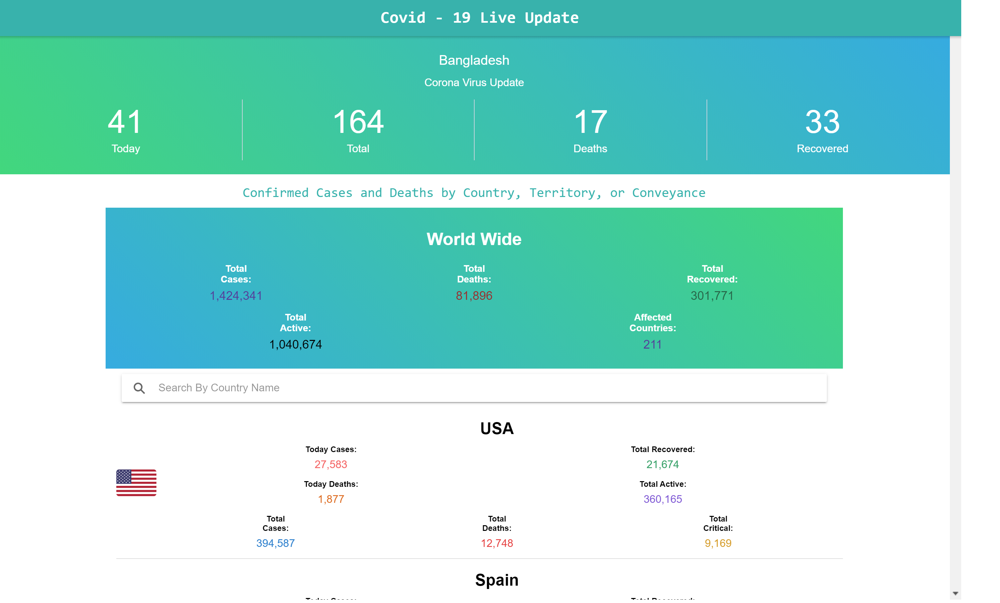

# Ionic Angular covid-19
    This simple ionic 5 project that fetch the data from api end point and show the data on home page.
    For css i use <b>TailWindcss</b>
    FrameWork: Ionic 5
    Language: Angular
    API Source:
        https://github.com/novelcovid/api
    Data Source:
        https://www.worldometers.info/coronavirus/
        https://github.com/CSSEGISandData/COVID-19/tree/master/csse_covid_19_data/csse_covid_19_time_series

